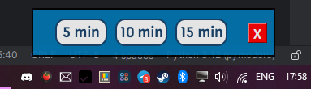
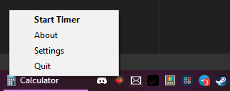

# Pymodoro

A simple Pomodoro timer that lives in your tray and does nothing until you set a timer.

- Simple GUI via TKinter
- screeninfo 0.8.1
- pystray 0.19.5
- Pillow 10.3
- playsound 1.3.0
- Python 3.12.3

Images used were created by me for the sole purpose of this small thing.
Audio files are royalty-free and distributed under a Creative Commons license.